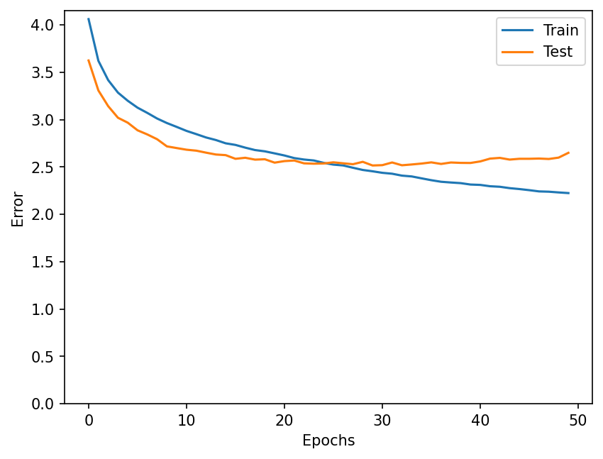
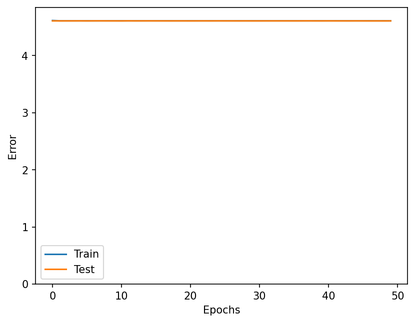
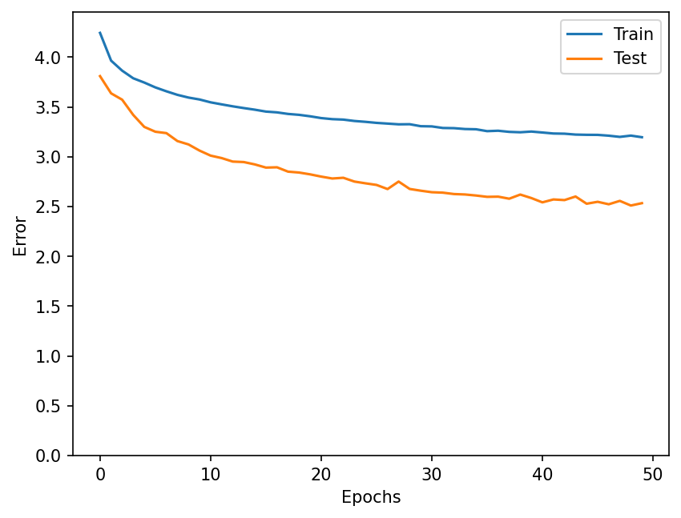
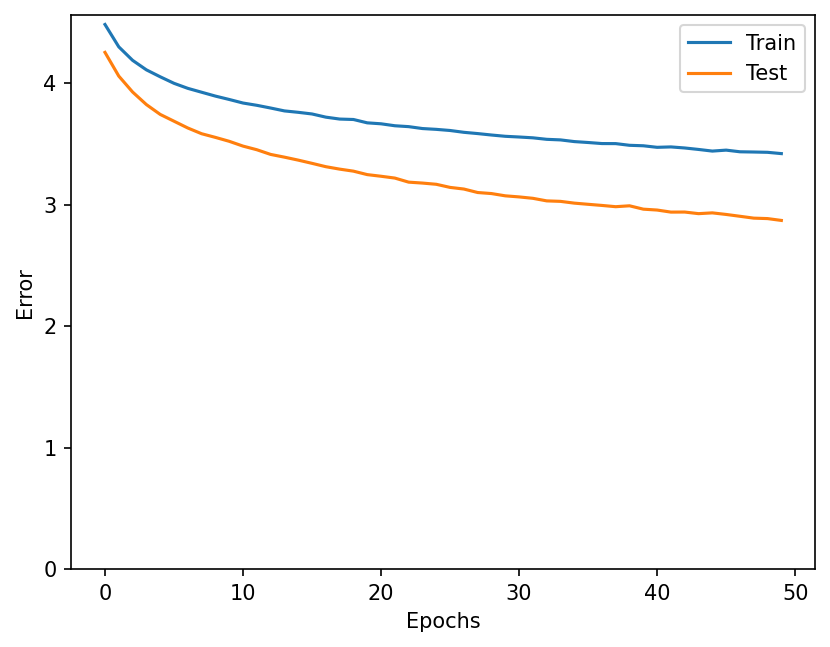
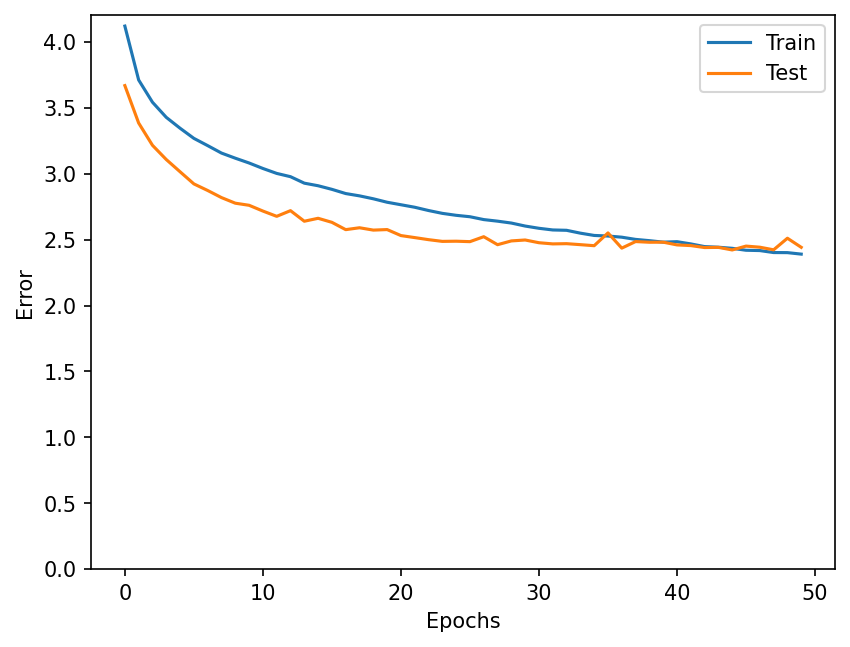

# CIFAR100 Net4 実験まとめ (2026-05-11)

|データセット|前処理|モデル|エポック数|学習率|accuracy|最終TrainLoss|最終TestLoss|グラフ|コメント|
|---|---|---|---:|---:|---:|---:|---:|---|---|
|CIFAR100|なし|Net4 (Conv 3->32->64, FC 64x6x6->256->100, Dropout 0.5)|50|Adamデフォルト|0.3526|2.223766|2.648635||ノイズ無によりtrainデータがいい感じに学習されている|
|CIFAR100|ランダムノイズ付与|Net4 (Conv 3->32->64, FC 64x6x6->256->100, Dropout 0.5)|50|1e-2|0.0100|4.608928|4.607088||学習率が大きすぎて、最適解を飛び越えてしまったと考えられる|
|CIFAR100|ランダムノイズ付与|Net4 (Conv 3->32->64, FC 64x6x6->256->100, Dropout 0.5)|50|Adamデフォルト|0.3594|3.196093|2.534167||ランダムノイズ条件では、lr=1e-4より高いaccuracyを確認|
|CIFAR100|ランダムノイズ付与|Net4 (Conv 3->32->64, FC 64x6x6->256->100, Dropout 0.5)|50|1e-4|0.2927|3.419802|2.869813||学習率デフォルトと比べてlossが減るスピードが遅い|
|CIFAR100|Erasing|Net4 (Conv 3->32->64, FC 64x6x6->256->100, Dropout 0.5)|50|Adamデフォルト|0.3809|2.389951|2.441662||ノイズを小さくしたことによりtrainデータが順調に学習されている|

備考:
- `ml_gpu311` 環境で実行した結果を記載。
- 各実験はそれぞれ対応するチェックポイントから最終損失を取得（`net4_cifar100_checkpoint.pt`, `net4_cifar100_random_checkpoint.pt`, `net4_cifar100_lr1e2_checkpoint.pt`, `net4_cifar100_lr1e4_checkpoint.pt`, `net4_cifar100_erasing_checkpoint.pt`）。
